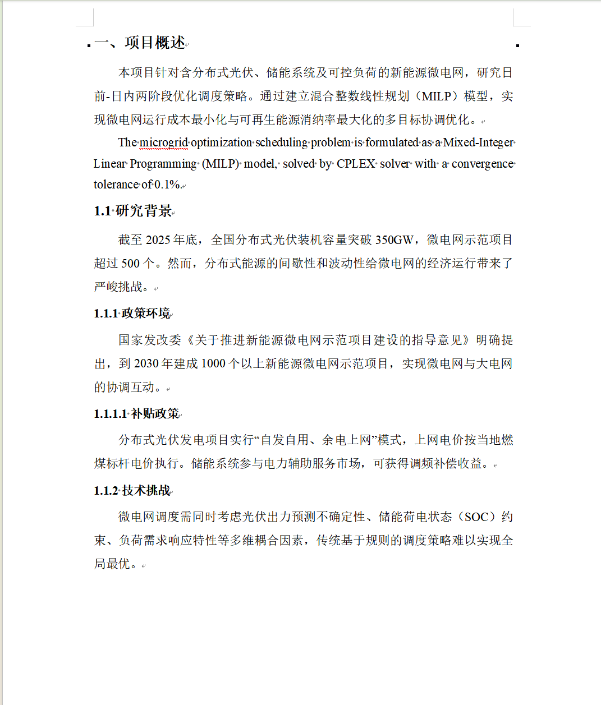
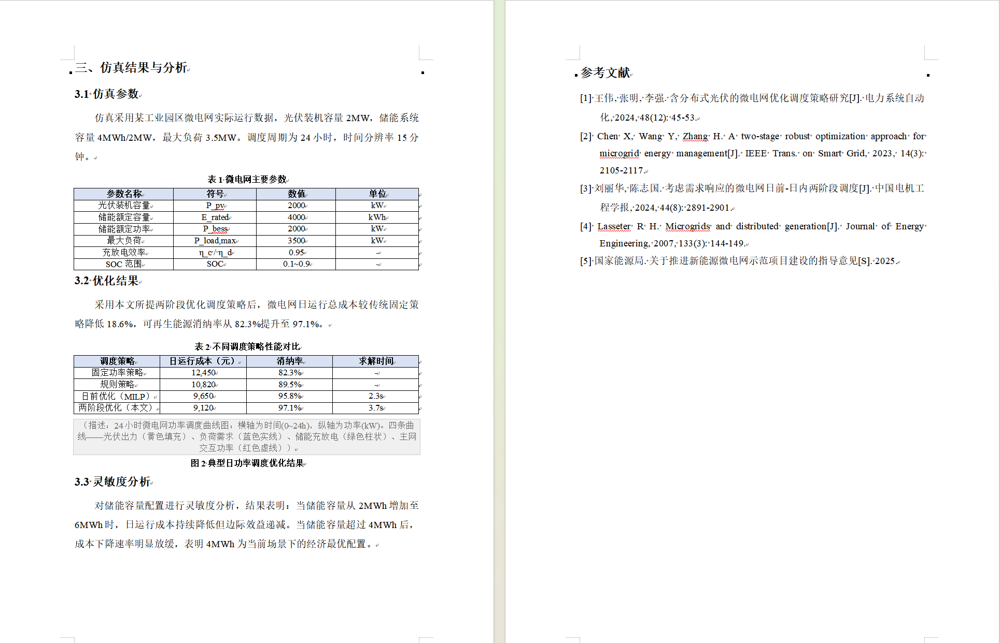
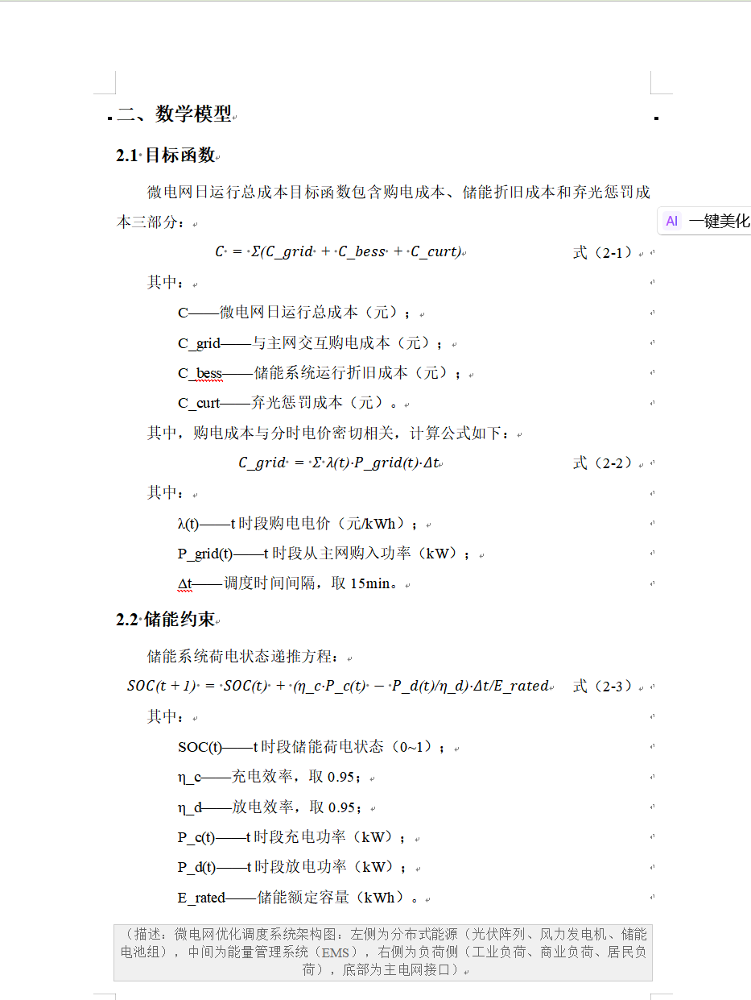

# SkillRepo - 私人定制技能库

## 项目简介

SkillRepo 是一个私人定制的技能库，用于管理和分享各种专业技能和工具。本仓库包含通用技能和专业技能，旨在将个人能力具象化，方便在各种环境中使用。

## 目录结构

```
├── docx-cn-skill/         # 中文技术文档Word生成技能
│   ├── .claude/           # Claude插件配置
│   ├── .claude-plugin/    # 插件元数据
│   ├── imag/              # 图片资源
│   ├── test/              # 测试文件
│   ├── package.json       # 依赖配置
│   └── package-lock.json  # 依赖锁定文件
├── LICENSE                # 许可证文件
└── README.md              # 项目说明文档
```

## 技能列表

### docx-cn-skill

**功能**：生成符合国内技术文档标准的Word文档

**特点**：
- 支持A4纸张格式
- 采用宋体字体
- 三级标题体系（小二/小三/四号/小四）
- 1.5倍行距
- 首行缩进2字符
- 支持图片、表格、页脚页码等元素

**使用场景**：
- 技术方案编写
- 项目报告生成
- 学术论文排版
- 正式文档制作

## 技术文档示例

以下是使用docx-cn-skill生成的技术文档示例：

### 文档目录


### 项目概述



### 数学模型



### 仿真结果与分析



## 安装使用

1. **克隆仓库**
   ```bash
   git clone git@github.com:WZ2819365003/skillRepo.git
   ```

2. **安装依赖**
   ```bash
   cd skillRepo/common/docx-cn-skill
   npm install
   ```

3. **使用技能**
   - 在Trae或Claude中直接调用相关技能
   - 或通过API方式集成到其他系统

## 贡献指南

1. Fork本仓库
2. 创建特性分支
3. 提交更改
4. 推送到分支
5. 打开Pull Request

## 许可证

本项目采用MIT许可证。

## 联系方式

如有问题或建议，请通过以下方式联系：
- GitHub Issues: [https://github.com/WZ2819365003/skillRepo/issues](https://github.com/WZ2819365003/skillRepo/issues)

---

*本仓库不定期更新，欢迎关注！*